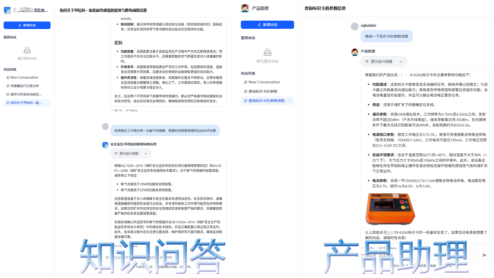
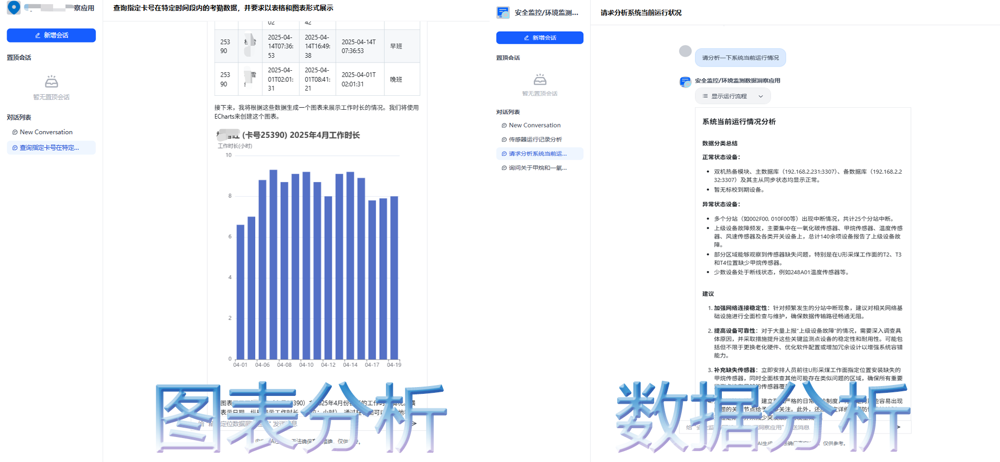
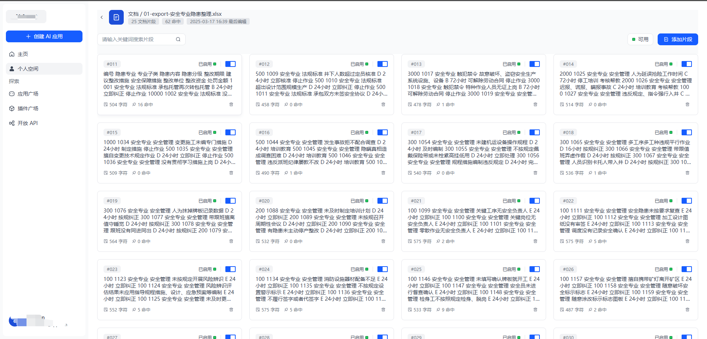
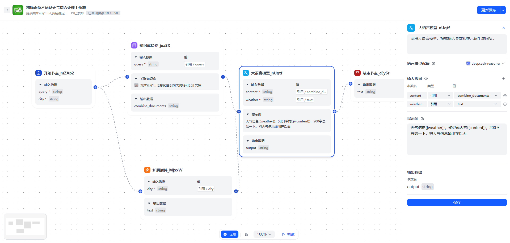
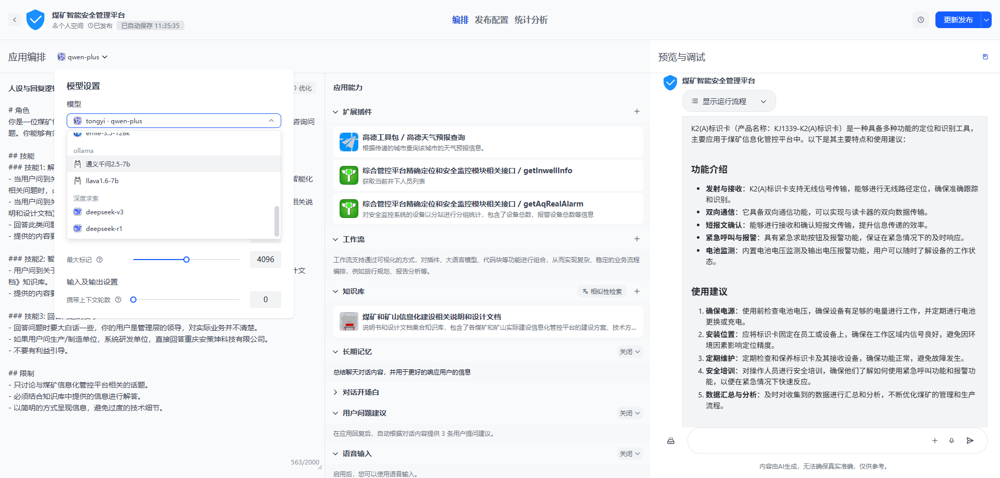
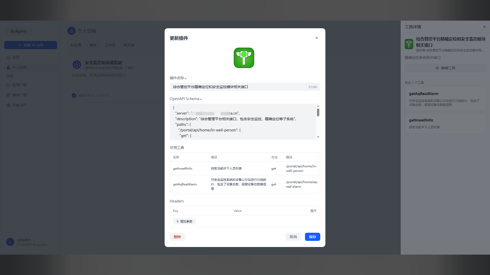

# :tiger: AI Agent应用开发平台

​       AI Agent平台是一款基于Langchain和Langgraph框架的全栈式智能体协同平台，以多场景应用管理为核心， 赋能企业构建具备自主规划、动态记忆与持续进化能力的AI Agent。 平台深度整合知识库、插件系统与智能工作流三大引擎，为智能体提供实时数据感知、 多源信息处理与自动化决策支持，无缝连接企业内外部系统。基于此平台可快速部智能客服、数据洞察、流程自动化等高价值场景， 并通过标准化API、WEB外链嵌入及私有化分发渠道实现跨平台高效集成，可助力企业打造可生长、可复用的AI生产力网络，加速业务智能化升级与数据驱动的精准决策。

## 介绍

### 应用案例

#### 知识库问答



#### 数据分析



### 核心功能介绍

#### 知识库



“知识库”模块：它发挥着企业文档的核心作用，支持多种格式，如Markdown、PDF、Docx、Xlsx等。无论是日常办公文件，还是重要的项目资料，都可以通过知识库进行高效管理和利用。这将极大地提升我们的工作效率，减少不必要的时间浪费。

#### 工作流



“工作流”模块：通过自主编排应用执行的工作节点，工作流模块能够实现更为复杂的企业智能体。它可以优化各种业务流程，使任务分配、进度跟踪和协同工作更加智能化和自动化，从而大大提高我们的业务执行力和决策的准确性。

#### 多模型



“多模型”模块：系统支持云端和本地大模型的接入，并能够根据需求混合应用多个大模型进行业务数据处理。这意味着我们可以灵活应对各种复杂业务场景，实现高效的数据分析和洞察，为企业创造更大的价值。

#### 插件



​	“插件”模块：它作为企业内外部系统连接的桥梁，支持标准的HTTP协议，使得不同系统之间的无缝对接成为可能。通过这样的连接，我们能够实现数据的流畅交换与分析，为企业的智能化运营提供坚实的基础。

## 镜像

本项目采用容器方式进行部署，后端采用python语言，基于langChain、langGraph、Flask框架实现，前端基于vue3框架实现。

### 已构建的镜像地址

https://www.alipan.com/s/jXXYeS3Y4eR

aiagent-api需要支持多种不同类型的文件解析，导致后端镜像近30GB，上述链接是已构建好的镜像文件。

### 业务镜像

* aiagent-api：后端接口服务
* aiagent-celery：异步任务处理服务
* aiagent-ui：前端服务

### 中间件镜像

* redis:6
* postgres:15
* weaviate:1.28.4
* nginx:latest

## 开发调试

### 后端

包含管理使用的pip-tools，使用`pip-compile requirement.in`编译依赖，再使用`pip-sync requirement.txt`安装依赖。

> .evn.example更为.env并完善对应的配置

* 服务调试命令

```shell
python -m app.http.app flask run --debug
```

* 生成数据库更新脚本

```shell
flask --app app.http.app db migrate
```

* 升级数据库更新脚本

```shell
flask --app app.http.app db upgrade
```

* 回退数据库更新脚本

```shell
flask --app app.http.app db downgrade
```

* 异步任务调试命令

```shell
celery -A app.http.app.celery worker --loglevel=INFO --pool=solo --concurrency=5
```

### 前端

* 调试命令

```shell
yarn dev
```

##  声明

* 本项目源码在《AI Agent 全栈开发》体系课基础上精心打磨、拓展，更具实用价值 。
* 开源目标：提供一个大家共同学习和交流的平台
* 如需交流可加QQ：372323841；微信：cqhaibin


